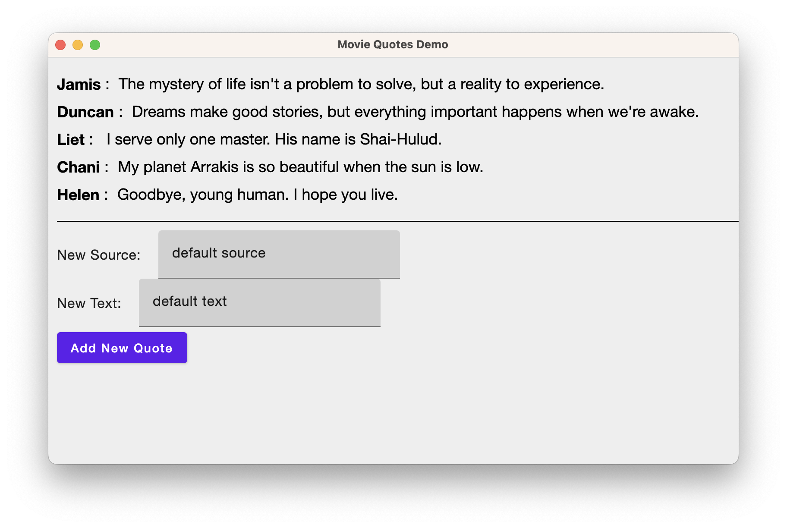

# Multiplatform Madness With Compose (Plus Friends)

## Workshop Delivered At [KotlinConf'23](https://kotlinconf.com/workshops/)

### Instructors
* **Garth Gilmour** - [Email](mailto:garth.gilmour@jetbrains.com) | [Twitter](https://twitter.com/GarthGilmour)
* **Pamela Hill** - [Email](mailto:pamela.hill@jetbrains.com) | [Twitter](https://twitter.com/pamelaahill) 
 
### Workshop Description

Compose may have started out on Android, but it has since matured into a multiplatform framework that provides a unified approach to creating clients.

Whether on the Web, Desktop or Mobile, you can share the same language, APIs, patterns, and even custom components. Looking beyond that, you can integrate with the wider multiplatform world of (for example) networking clients, threading libraries, testing utilities, and FP toolkits.

In this workshop, we will first explore, and then extend, a multiplatform UI built for disparate environments. You will deepen your understanding, not just of multiplatform and Compose in general, but also architecting and enhancing DSLs, structured concurrency with coroutines, functional architecture, and the internals of the Kotlin compiler.

### Prerequisites

The only requirement for this workshop is that you be an experienced Kotlin programmer. Any prior experience that you have in mobile, desktop and/or web development will be very useful - but such experience is not essential.

### Course Projects Overview

Most of this repository is made up of self contained Kotlin projects, organised into three folders:

* The `examples` folder contains examples of the different implementations of Compose.
* The `exercises` folder contains starter projects for some of the practicals we will attempt.
* The `solutions` folder contains sample solutions for all of the exercises.
* The `services` folder contains REST services written in [Ktor](https://ktor.io/). These are used by the projects above to illustrate networking and the use of coroutines for asynchronous operations.

### Setting Up Your Machine

For this workshop you will need

* An up to date version of [JetBrains IntelliJ](https://www.jetbrains.com/idea/). Either the Community or the Ultimate edition is fine.
* Version 11 of the Java Development Kit or above.
* The Chrome and/or Firefox browsers.
* Permission on your machine to join the conference network and run Gradle build files.
* *(Optional)* The course includes examples of Compose UI's running on Android and iOS. It is fine to simply watch these being run, but if you wish to play with them yourself you will need Android Studio installed on a macOS machine configured for Android and iOS development. The `preparing-for-compose-on-ios.md` file in the `documents` folder provides detailed information on how to do this.

We recommend that after setting up your machine you open the `examples/MovieQuotesDesktop` project and run `src/jvmMain/kotlin/movie.quotes/Main.kt`. You should then see the output below:

### Course Manual

The slides for the course will be shared separately as a PDF.

### Pre / Post Course Reading

The `useful-links.md` file in the `documents` folder contains resources that you may wish to look through in advance of the delivery, and then investigate in depth afterwards. But none of these are prerequisites.

### Course Projects In Detail

Below is a detailed description of each of the course projects, along with any special instructions required to run them. The instructors will guide you through these projects on the day, but you may find this summary helpful when reviewing the material afterwards. 

#### Examples

* **examples/HelloComposeViaMosaic** - A simple example of using the [Mosaic Project](https://github.com/JakeWharton/mosaic) to create a UI on the command line. This illustrates the power and ubiquity of Compose. Note that, in order to work correctly, this demo must be build as a JAR (via the `shadowJar` Gradle task) and then run from the command line via `java -jar ./build/libs/HelloComposeViaMosaic-1.0-SNAPSHOT-all.jar`
* **examples/UsingMolecule** - A simple example of using the [Molecule Project](https://github.com/cashapp/molecule) to manage Coroutine Flows via Compose. This illustrates that Compose is not just for User Interfaces.
* **examples/MovieQuotesDesktop** - Using [Compose for Desktop](https://www.jetbrains.com/lp/compose-desktop/) to create a basic User Interface.
* **examples/MovieQuotesDesktopWithTesting** - The above example modified to support and include UI tests.
* **examples/MovieQuotesWeb** - The Movie Quotes example rewritten to use [The Compose DOM Library](https://compose-web.ui.pages.jetbrains.team/). Note that this demo should be run via the `jsBrowserDevelopmentRun` task.
* **examples/MovieQuotesCombined** - The two projects listed above unified as a Multiplatform Project where common code is shared. 
* **examples/DesktopComposeInDepth** - Detailed examples of different aspects of Desktop Compose, including Side Effects, Coroutines, State Management and Themes. 
* **examples/ComposeWebInDepth** - Detailed examples of different aspects of the Compose DOM Library, including Structured Input, Networking and Testing.

#### Exercises

* **exercises/CalculatorExercise** - Starter project for *Desktop Calculator* (the first exercise)
* **exercises/StaffSearchExercise** - Starter project for *Staff Search* (the fourth exercise)

#### Solutions

* **solutions/CalculatorDesktopSolution** - Sample implementation for *Desktop Calculator* (the first exercise)
* **solutions/CalculatorDesktopTestingSolution** - The above solution with test cases added (the second exercise)
* **solutions/CalculatorDesktopViewModelSolution** - The above solution rewritten to use a ViewModel
* **solutions/StaffSearchSolution** - Sample implementation for *Staff Search* (the fourth exercise)
* **solutions/StaffSearchViewModelSolution** - The above solution rewritten to use a ViewModel
* **solutions/CalculatorWebSolution** - Sample implementation for *Web Calculator* (the fifth exercise)
* **solutions/CalculatorCombinedSolution** - Sample implementation for *Combined Calculator* (the sixth exercise)

#### Services

* **services/SampleService** - Two REST services, written using [Ktor](https://ktor.io/). These are used by the projects above. Once you run the project you can visit [the index page](http://0.0.0.0:8080/index.html) to access an HTML / JS client for the first service and sample requests for both.